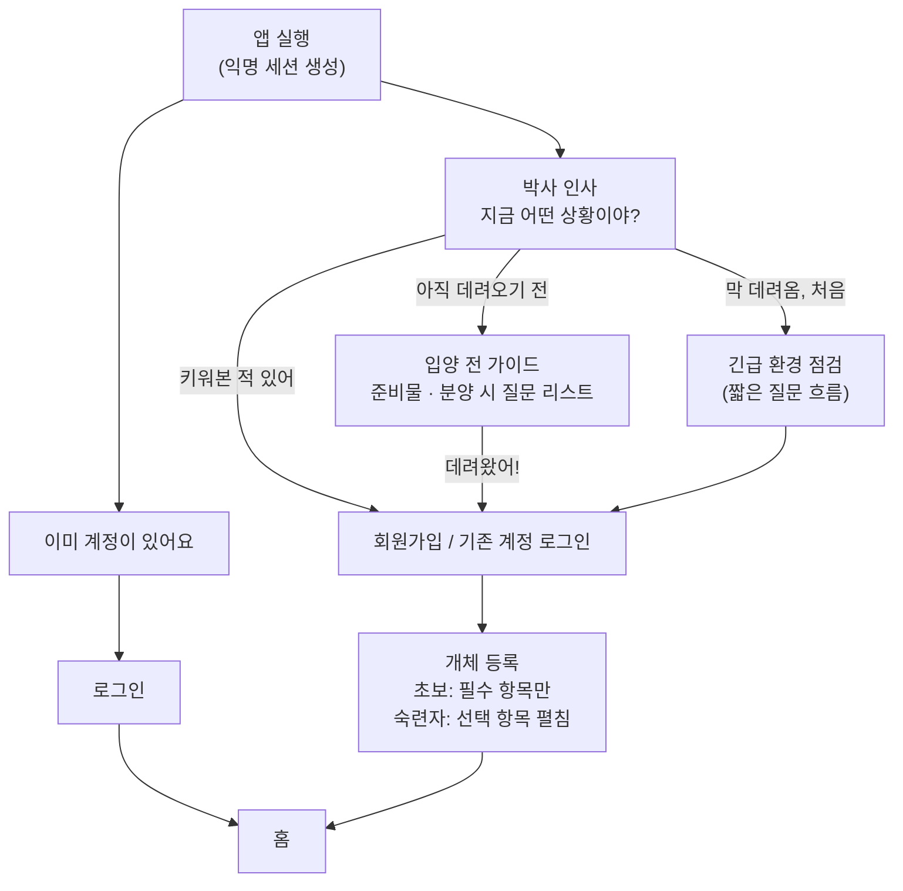
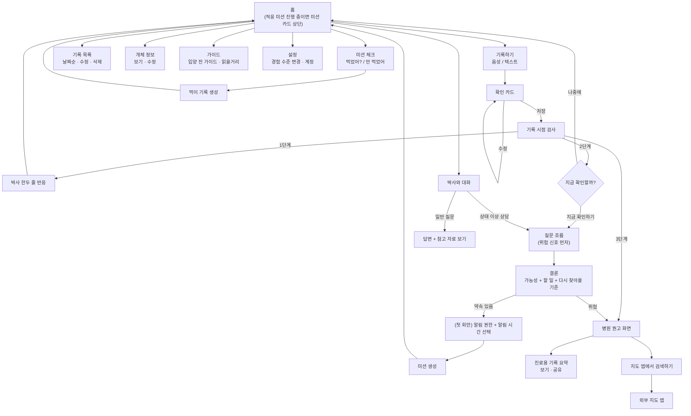
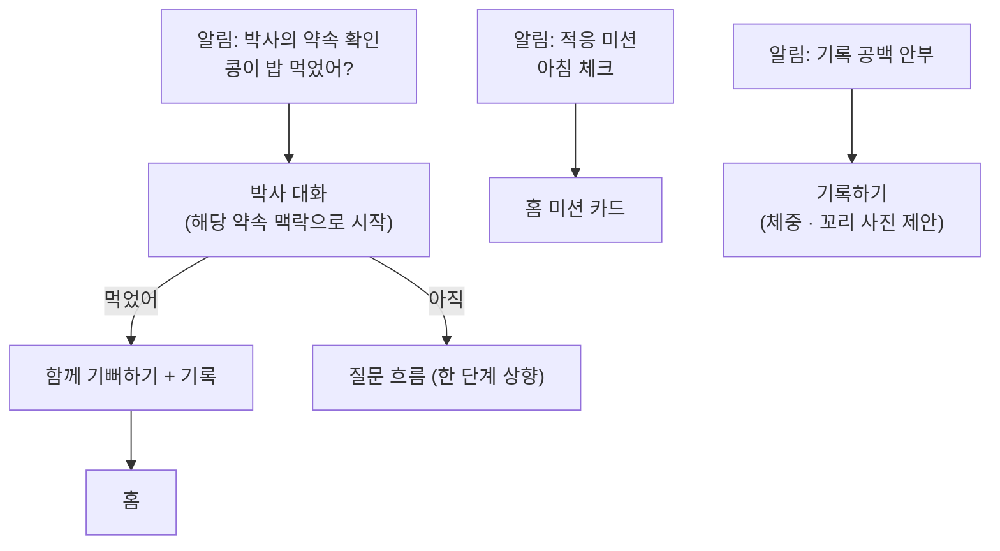

# 08. User Flow

> 상태: 확정 (2026-10-07)
> 근거 문서: 01 ~ 07
> 다음 단계: 화면 목록

앱을 세 덩어리로 나눠서 그린다.

1. **첫 실행 플로우**: 앱을 처음 열어서 홈에 도착할 때까지
2. **홈 플로우**: 홈에서 기록, 박사 대화, 미션, 설정 등으로 뻗어나감
3. **외부 진입 플로우**: 알림을 눌러 들어올 때

---

## 1. 첫 실행 플로우 (확정)



### 회원가입 시점: 개체 등록 직전

- 박사 인사, 입양 전 가이드, 긴급 환경 점검은 **가입 없이** 체험
- 데이터를 저장해야 하는 순간(개체 등록)에 가입 요청
- 급한 1B 사용자에게 가입보다 긴급 점검이 먼저

### 기술 메모: Supabase 익명 로그인

- 기기 고유값(deviceId)이 아니라, 앱 실행 시 **이메일 없는 진짜 사용자 계정**을 생성 (`is_anonymous: true`)
- 회원가입 = 새 계정 생성이 아니라 **익명 계정에 이메일/소셜 계정을 연결**
- user_id가 처음부터 끝까지 같음 → **데이터 매핑 작업 불필요**, RLS도 user_id 기준 동일
- deviceId를 피하는 이유: iOS 재설치 시 값이 바뀔 수 있음, deviceId 유출 시 데이터 탈취 위험

### 주의점

| 상황                                            | 결과                                                                              | 대응                                                    |
| ----------------------------------------------- | --------------------------------------------------------------------------------- | ------------------------------------------------------- |
| 가입 전 앱 삭제                                 | 익명 계정 접근 불가                                                               | 가입 전엔 인사 답변·긴급 점검 정도만 쌓여 손실 작음     |
| 앱만 열고 떠난 사용자                           | 익명 계정 누적                                                                    | 일정 기간 지난 익명 계정 정리 (V0 이후)                 |
| 기존 회원이 새 기기에서 익명으로 시작 후 로그인 | **기존 계정 데이터는 그대로 보임.** 새 기기에서 잠깐 만든 익명 계정 내용만 버려짐 | 첫 화면에 "이미 계정이 있어요" → 인사 질문 없이 바로 홈 |

---

## 2. 홈 플로우 (확정)



### 재사용되는 화면 (컴포넌트로 설계)

| 화면               | 들어오는 곳                                           |
| ------------------ | ----------------------------------------------------- |
| **질문 흐름**      | 1B 긴급 환경 점검, 기록 후 2단계, 박사 상태 이상 상담 |
| **병원 권고 화면** | 기록 후 3단계, 박사 상담 결론(위험)                   |

### 이 단계에서 추가된 기능

- **기록 목록 (날짜순 + 수정·삭제)** — Must
  잘못된 기록은 박사 판단과 이상 감지 규칙을 오염시킴 (예: "묽음" 중복 저장 → 잘못된 2단계 경고)
- **개체 정보 보기·수정** — Must (다른 서비스의 프로필 수정에 해당)

---

## 기록 방식: 사용자 주도 vs 박사 주도

> **2026-10-07 변경**: 알림은 로컬 알림이 아닌 **서버 푸시**로 구현 (10 DB 구조 참고). 아래의 "로컬 알림 예약·재예약", `notification_id`, "예약된 알림 취소"는 당시 기준이며, 서버 푸시에서는 발송 직전 DB 상태 확인으로 대체됨.

**기본은 사용자 주도.** 일이 생긴 순간에 남기는 기록이 가장 정확하다.
**박사 주도는 "상황이 있을 때만".** 고정 주기로 매일 묻지 않는다.

| 방식                      | 언제                                    | 분류       |
| ------------------------- | --------------------------------------- | ---------- |
| 사용자 주도 기록          | 언제든                                  | Must       |
| 미션 체크                 | 적응 미션 기간                          | Must       |
| 박사의 약속 확인          | 상담 후 약속했을 때                     | Must       |
| **기록 공백 안부**        | 기록이 N일 이상 끊겼을 때               | **Should** |
| **알림 시간 선택**        | 알림 권한 요청 시 "보통 몇 시쯤 밥 줘?" | **Should** |
| 정기 체크 (예: 매주 체중) | 설정에서 원하는 사람만 켬               | Later      |

### 기록 공백 안부

> 🔔 "콩이 요즘 잘 지내? 오랜만에 체중이랑 꼬리 사진 한번 남겨볼까?"

- 목적: 익숙해진 사용자의 **기준선 유지** (문제 발생 시 비교할 최근 기록 확보)
- 구현: 기록 저장 시마다 "N일 뒤 안부" 로컬 알림을 **다시 예약** (기존 예약 취소 후 재예약)
  → 꾸준히 기록하는 사람에겐 알림이 가지 않고, 끊긴 사람에게만 감
  → 복잡한 트리거 관리 불필요

### 썸원(SumOne) 참고

- 유사점: 정해진 시간에 질문 → 가볍게 답 → 캐릭터(반려몽) 성장, 사용자가 질문 시간 설정
- 차이점: 썸원은 **매일 여는 것 자체가 가치**. 우리는 **매일 쓰게 강요하지 않음**
- 빌려온 것: **사용자가 시간을 정하게 하기** → 알림 시간 선택
- 보류한 것: 기록이 쌓이면 무언가 자라는 재미 요소 → 정서적 가치 영역이라 Later

---

## 3. 외부 진입 플로우 (확정)

> **2026-10-07 변경**: 알림은 로컬 알림이 아닌 **서버 푸시**로 구현 (10 DB 구조 참고). 아래의 "로컬 알림 예약·재예약", `notification_id`, "예약된 알림 취소"는 당시 기준이며, 서버 푸시에서는 발송 직전 DB 상태 확인으로 대체됨.



### 알림 전에 사용자가 먼저 기록한 경우

문제: 박사가 "3일 뒤에 먹었는지 물어볼게"라고 약속했는데, 사용자가 이틀째에 먼저 "먹었어"를 기록.
그대로 두면 다음 날 알림이 또 "콩이 밥 먹었어?"라고 물음
→ 박사가 기억을 못 하는 것처럼 보임 → **"내 도마뱀을 기억하는 박사"와 정면 충돌**

해결: **기록 시점 검사**(04)에 역할 추가. 기록 저장 시 이상 감지 규칙과 함께 **진행 중인 약속이 이 기록으로 해결되는지** 확인.

```text
먹이 기록 저장 (섭취)
  ↓
기록 시점 검사
  ├─ 이상 감지 규칙 확인 (기존)
  └─ 진행 중인 약속 확인 (추가)
       "먹었는지 확인" 약속이 있음
         ↓
       약속 완료 처리 + 예약된 알림 취소
         ↓
       🧑‍🔬 "먹었구나! 내가 내일 물어보려고 했는데 먼저 알려줬네 🎉"
```

- 박사가 약속을 기억하고 먼저 알아채는 모습 + 알림 중복 제거
- **미션도 같은 원리**: 미션 체크 대신 일반 기록으로 "먹었어"를 남겨도 해당 미션 항목 자동 체크

### 데이터 메모 (DB 구조 단계에서 최종 정리)

```text
follow_ups
  + resolves_on: 'feeding_eaten' | 'defecation' | 'weight' | ...   ← 어떤 기록이 들어오면 해결되는지
  + notification_id                                                ← 취소할 로컬 알림 식별자
  status: 'pending' | 'done' | 'resolved_by_log' | 'skipped' | 'replaced'

mission_items
  + linked_log_type   ← 일반 기록으로도 체크되도록 (03에 이미 있음, 역할 명시)
```

---

## 결정 로그

| 날짜       | 결정                                                    | 이유                                                                              |
| ---------- | ------------------------------------------------------- | --------------------------------------------------------------------------------- |
| 2026-10-07 | 회원가입은 개체 등록 직전                               | 박사를 먼저 경험한 뒤 가입 요청 → 거부감 감소. 1B는 긴급 점검이 우선              |
| 2026-10-07 | Supabase 익명 로그인 사용                               | 같은 user_id 유지로 매핑 불필요. deviceId 방식의 재설치·보안 문제 회피            |
| 2026-10-07 | 첫 화면에 "이미 계정이 있어요"                          | 기존 회원이 새 기기에서 인사 질문을 다시 거치지 않도록                            |
| 2026-10-07 | 질문 흐름·병원 권고 화면은 재사용 컴포넌트              | 여러 진입점에서 공유                                                              |
| 2026-10-07 | 기록 목록(수정·삭제), 개체 정보 수정 Must 추가          | 06에서 누락. 잘못된 기록이 박사 판단을 오염                                       |
| 2026-10-07 | 기록은 사용자 주도가 기본, 박사 주도는 상황이 있을 때만 | 기록 정확도, "매일 강요하지 않는다" 원칙                                          |
| 2026-10-07 | 기록 공백 안부 Should                                   | 기준선 유지. 재예약 방식으로 단순 구현                                            |
| 2026-10-07 | 알림 시간 선택 Should                                   | 알림이 사용자 생활 패턴에 맞아야 답할 수 있음 (썸원 참고)                         |
| 2026-10-07 | 정기 체크·성장 재미 요소 Later                          | 매일 사용 유도는 원칙과 충돌, 정서적 가치 영역                                    |
| 2026-10-07 | 외부 진입 플로우 확정                                   | 알림 종류별로 맥락에 맞는 화면으로 연결                                           |
| 2026-10-07 | 기록 시점 검사가 진행 중인 약속·미션도 해결             | 먼저 기록했는데 알림이 또 오면 박사가 기억 못 하는 것처럼 보임. 한 줄 설명과 충돌 |
| 2026-10-07 | 알림 구현을 서버 푸시로 변경                            | 10 DB 구조 단계에서 결정. 여러 기기·재설치 대응, 취소 로직 불필요                 |
