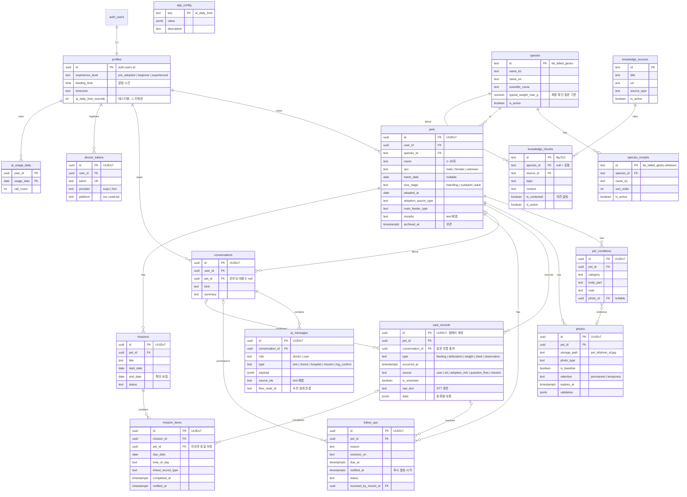

# 10. DB 구조

> 상태: **완성 (2026-10-07)**
> SQL 원본: `supabase/migrations/20261007000000_init.sql` (단일 기준)
> 검증: PostgreSQL 16 + Supabase 환경 모사에서 마이그레이션 실행 및 시나리오 테스트 75개 통과
> 다음 단계: 와이어프레임

---

## 한눈에 보기

**테이블 17개**

| 영역        | 테이블                                    | 역할                                                         |
| ----------- | ----------------------------------------- | ------------------------------------------------------------ |
| 사용자      | `profiles`                                | 경험 수준, 알림 시간, 시간대, 테스터 한도 (auth.users와 1:1) |
| 기준 데이터 | `species`, `species_morphs`               | 종 정보·체중 기준, 종별 모프 선택지                          |
| 앱 설정     | `app_config`                              | 배포 없이 바꾸는 서버 값 (박사 일일 한도 등)                 |
| 개체        | `pets`, `pet_conditions`, `photos`        | 신분증: 개체 정보, 특이사항, 사진 메타데이터                 |
| 기록        | `care_records`                            | 일기장: 먹이·배변·체중·탈피·관찰 통합                        |
| 박사        | `conversations`, `ai_messages`            | 대화, 타입별 메시지                                          |
|             | `follow_ups`, `missions`, `mission_items` | 박사의 약속, 적응 미션과 날짜별 항목                         |
| 알림        | `device_tokens`                           | 서버 푸시용 기기 토큰                                        |
| 사용량      | `ai_usage_daily`                          | 사용자별 박사 일일 호출 횟수                                 |
| 지식        | `knowledge_sources`, `knowledge_chunks`   | 출처, 지식 자료 조각                                         |

---

## ERD



---

## 설계 원칙

| 원칙           | 내용                                                                     | 이유                                                                    |
| -------------- | ------------------------------------------------------------------------ | ----------------------------------------------------------------------- |
| 목표           | 총 사용자 100만 규모에서도 구조 변경 없이 확장                           | 나중에 바꾸기 어려운 것은 지금, 쉽게 붙는 것은 나중에                   |
| 기본 키        | **UUIDv7**, 앱에서 생성 (DB 기본값은 안전장치)                           | 시간순이라 대용량 인덱스 성능 유지, 낙관적 업데이트·재시도 시 중복 방지 |
| 시간           | `timestamptz`, 날짜 계산은 **사용자 시간대** 기준                        | 자정 근처 기록, 해외 확장                                               |
| 선택지 값      | Postgres enum 대신 `text + check`                                        | V0는 선택지가 자주 바뀜                                                 |
| 삭제           | 실제 삭제. 단 개체는 **보관**, 지식 자료는 **비활성화**                  | 추억 보존, 과거 답변의 참고 자료 유지                                   |
| 기록           | **`care_records` 하나로 통합** (`type` + 검증된 `data jsonb`)            | 기록 목록·STT 다중 저장·기록 시점 검사가 모두 "기록 전체"를 다룸        |
| 권한           | **`pets`에만 `user_id`**, 하위 테이블은 `pet_id`로 확인                  | 소유권 이전·가족 공유 시 권한 함수 한 곳만 수정                         |
| 권한 함수      | 집합 반환 함수 `accessible_pet_ids()` + 조건 없는 `pets(user_id)` 인덱스 | 쿼리당 1회 실행, 항상 인덱스 사용                                       |
| 기록자         | 하위 테이블엔 `created_by`                                               | 가족 공유 시 "누가 남겼는지". 권한과 의미 분리                          |
| 내부 함수      | `private` 스키마 (API 비노출)                                            | `public` 함수는 API(RPC)로 자동 노출됨                                  |
| 서버 전용 함수 | `public`에 두되 `service_role`만 실행                                    | Edge Function이 호출                                                    |
| 예외 처리      | 가능한 한 **DB가 막는다** (제약·트리거·RLS)                              | 앱 버그가 있어도 데이터가 오염되지 않음                                 |
| 리전           | Supabase 서울 리전                                                       | 네트워크 왕복 최소화                                                    |

---

## 영역별 핵심

### 사용자

- 계정(익명 포함)이 생기면 트리거가 `profiles` 자동 생성 → 익명 → 회원가입 전환 시 같은 id로 유지
- 사용자 닉네임은 받지 않음. 박사는 "**○○ 집사**"로 부름 (개체 이름 활용)
- `ai_daily_limit_override`는 관리자만 변경 가능 (사용자가 바꾸면 트리거가 거부)

### 개체 — 신분증

- 나이: 생년월일 또는 크기 단계 중 하나 필수, 분양일 이전 출생, 미래 날짜 불가
- **익명 계정은 개체 등록 불가** → "가입 후 등록" 흐름(08)을 DB가 보장
- **보관(`archived_at`)**: 무지개다리·입양 보냄 시 기록·사진은 추억으로 유지, 홈·박사에서 제외, 진행 중 약속·미션 자동 종료, 새 기록 불가
- 사진: 파일은 Storage `pet-photos/{pet_id}/{photo_id}.jpg`, 경로의 pet id로 권한 확인. 업로드 순서는 **파일 → 행**

### 기록 — 일기장

| `type`        | `data`                                                                   | 예시                                                             |
| ------------- | ------------------------------------------------------------------------ | ---------------------------------------------------------------- |
| `feeding`     | 먹이 종류, 수량(선택), 결과 (eaten / refused / partial / unknown)        | `{ "feeder_type": "cricket", "quantity": 3, "result": "eaten" }` |
| `defecation`  | 상태 (normal / soft / watery / unknown), 이상 소견(선택: 피·점액·미소화) | `{ "status": "soft", "abnormal": [] }`                           |
| `weight`      | 그램                                                                     | `{ "weight_g": 19.2 }`                                           |
| `shed`        | 상태 (complete / in_progress / stuck)                                    | `{ "status": "complete" }`                                       |
| `observation` | 무엇을, 답                                                               | `{ "key": "floor_temp", "value": "warm" }`                       |

- 개체 등록 시 첫 체중·분양 정보도 여기에 (`source = 'adoption_info'`)
- **체중**: DB는 20kg 안전선만, 흔한 오입력(19.2 → 192)은 앱 확인 질문이 잡음 (직전 체중 대비 30%↑ 또는 `species.typical_weight_max_g` 초과)

### 박사

- **개체 없는 대화**: 1B 긴급 점검은 가입·등록 전 → `conversations.pet_id`는 비어 있을 수 있음. 등록 직후 앱이 대화를 개체에 연결하고 답변을 관찰 기록으로 저장
- **메시지는 수정·삭제 불가.** 앱이 직접 쓰는 박사 메시지는 사전 설계 흐름(`flow_node_id` 있음)만, LLM 답변은 Edge Function만 저장 → 박사 메시지 위조 차단
- 선택지 답변은 박사 메시지를 수정하지 않고, 사용자 메시지에 `{ "answer_to": <message id>, "option_id": "ok" }`로 기록 (09의 `answeredOptionId` 대체)
- **약속**: 개체당 진행 중 1개 (새 약속이 기존을 자동 대체). 해당 기록이 들어오면 자동 해결
- **미션 항목**: 날짜별 행 (3일 × 3개 = 9행). 같은 날 같은 종류 기록이 들어오면 자동 체크

### 알림 — 서버 푸시

- 발송 직전 DB 상태 확인 → **보관된 개체·해결된 약속에 알림이 가는 것이 구조적으로 불가능**
- `claim_due_follow_ups()`가 발송 대상을 **선점** → 스케줄러가 겹쳐도 중복 발송 없음
- 토큰은 `register_device_token()`으로만 등록 → 같은 기기에서 다른 계정 로그인 시 토큰이 현재 계정으로 이동
- Expo Push Service(안드로이드·iOS 공통) 또는 FCM. iOS는 APNs 인증 키 연결 필요

### 박사 사용량 제한

| 단계           | 설정                                                                            |
| -------------- | ------------------------------------------------------------------------------- |
| 개발·테스트    | `app_config.ai_daily_limit = -1` (무제한, 현재 기본값)                          |
| 서비스 시작    | `app_config.ai_daily_limit`을 숫자로 변경 (대시보드에서 바로, 배포 불필요)      |
| 출시 후 테스트 | 테스터 계정만 `profiles.ai_daily_limit_override = -1` → 일반 사용자 한도는 유지 |

- Edge Function이 LLM 호출 직전 `consume_ai_quota(user_id)` → 허용이면 1 증가. 사전 설계 흐름은 LLM을 안 쓰므로 차감 없음
- 하루 기준은 사용자 시간대의 날짜
- 이후 무료/유료 한도 분리에도 같은 구조 사용

### 지식

| 단계   | 방식                                       | 언제                 |
| ------ | ------------------------------------------ | -------------------- |
| 1 (V0) | 해당 종의 활성 자료 전부를 프롬프트에      | 자료가 적을 때       |
| 2      | `topic`으로 먼저 거르고 관련 자료만        | 프롬프트가 길어질 때 |
| 3      | pgvector 의미 검색 (`embedding` 컬럼 추가) | 종·자료가 많아질 때  |

- `is_contested`: 의견이 갈리는 주제 → 박사가 "의견이 갈리는 부분이야"라고 균형 있게 답변 (05 품질 기준)
- 존재하지 않는 참고 자료 ID는 저장 시 **조용히 제거** (LLM이 ID를 지어내도 저장 실패 없음)

---

## 서버 작업 (Edge Functions + 스케줄러)

| 작업                 | 실행                | 내용                                                                                                     |
| -------------------- | ------------------- | -------------------------------------------------------------------------------------------------------- |
| `doctor-chat`        | 사용자 요청         | `consume_ai_quota` → LLM 호출(스트리밍) → 박사 메시지 저장                                               |
| `evaluate-record`    | 기록 저장 후        | 기록 시점 검사 (04): 최근 기록 규칙 판정 → 박사 반응, 약속 해결 여부 반환                                |
| `send-notifications` | 1분마다 (`pg_cron`) | `claim_due_follow_ups` + 미션 항목 → 사용자의 모든 토큰으로 발송, 실패 토큰 삭제                         |
| `daily-cleanup`      | 하루 1회            | 만료된 임시 사진, 행이 없는 고아 파일, 30일 지난 개체 없는 익명 계정 (`list_stale_anonymous_users`) 삭제 |
| `delete-account`     | 사용자 요청 (S13)   | Storage 사진 즉시 삭제 → Admin API로 계정 삭제 → DB는 cascade. **Apple 심사 요건**                       |

- Storage 파일은 SQL로 지우면 실제 파일이 남음 → 반드시 **Storage API**로 삭제
- 스케줄러 URL·키는 Supabase **Vault**에 저장
- 기록 공백 안부(Should) 구현 시 중복 방지용 "마지막 발송 시각" 컬럼 추가 예정

---

## 함수 실행 권한 (중요)

| 함수                                                                     | 실행 가능 역할                    | 이유                                                                 |
| ------------------------------------------------------------------------ | --------------------------------- | -------------------------------------------------------------------- |
| `private.accessible_pet_ids`, `accessible_conversation_ids`              | anon, authenticated, service_role | **RLS 정책이 사용자 권한으로 호출** → 권한이 없으면 모든 조회가 실패 |
| `private.uuid_generate_v7`                                               | 〃                                | 컬럼 기본값이 사용자 권한으로 실행                                   |
| `private.is_valid_care_data`                                             | 〃                                | check 제약이 사용자 권한으로 실행                                    |
| 트리거 함수들                                                            | (부여 불필요)                     | 트리거는 실행 권한 없이 동작                                         |
| `register_device_token`                                                  | authenticated                     | 앱이 호출                                                            |
| `consume_ai_quota`, `claim_due_follow_ups`, `list_stale_anonymous_users` | service_role                      | Edge Function 전용                                                   |

> `private` 스키마는 API에 노출되지 않으므로 실행 권한을 줘도 외부에서 직접 호출할 수 없음.

---

## 테이블로 만들지 않은 것

| 항목                                     | 위치                       | 이유                           |
| ---------------------------------------- | -------------------------- | ------------------------------ |
| 회원 계정                                | `auth.users` (Supabase)    | `profiles`로 1:1 연결          |
| 사진 파일                                | Supabase Storage           | 테이블엔 메타데이터만          |
| 질문 흐름 JSON, 입양 전 가이드, 읽을거리 | 앱 내장                    | 기기에서 즉시 실행 (로딩 없음) |
| 진료용 기록 요약                         | 병원 권고 메시지 `payload` | 권고 시점의 기록 상태 보존     |

**나중에 추가될 것**: `pet_members` (가족 공유 — 권한 함수만 수정), `enclosures` (사육장), `knowledge_chunks.embedding` (RAG)
**병목 측정 후**: 읽기 복제 DB, `care_records` 파티셔닝, 캐시 서버, LLM 요청 대기열

---

## 앱 쪽 원칙 — 로딩이 느껴지지 않게

| 원칙              | 방법                                                                                                |
| ----------------- | --------------------------------------------------------------------------------------------------- |
| 낙관적 업데이트   | 앱이 UUIDv7 생성 → 화면 즉시 반영 → 뒤에서 저장. 재시도는 `upsert(..., { ignoreDuplicates: true })` |
| 다중 기록         | STT 결과는 배열 하나로 insert → 전부 저장 또는 전부 실패                                            |
| 로컬 캐시         | TanStack Query 등으로 기기 캐시 → 홈·기록 목록 즉시 표시                                            |
| 사전 설계 흐름    | 질문 흐름 JSON을 앱에 내장 → 서버 왕복 없음                                                         |
| 피할 수 없는 대기 | LLM 스트리밍, STT 실시간 자막                                                                       |
| 콜드 스타트       | Edge Functions 첫 호출 지연은 실측 후 대응                                                          |

## 운영 원칙

- **마이그레이션**: Supabase CLI로 `supabase/migrations/`에 관리. 대시보드 직접 수정 금지 → 개발·운영 환경 동일
- **백업**: 운영 DB는 시점 복구(PITR) 활성화 (유료 플랜)
- **익명 로그인 남용 방지**: Supabase 설정에서 CAPTCHA, 요청 제한 활성화
- **박사 한도**: 서비스 시작 전 `ai_daily_limit`을 숫자로 바꾸는 것을 출시 체크리스트에 포함
- **개인정보 처리방침·동의**: 외부(노션 랜딩)에서 처리

---

## 예외 상황 처리

### 사용자·기준 데이터

| 상황                                   | 처리                 | 리액트에서 할 일    |
| -------------------------------------- | -------------------- | ------------------- |
| 익명 사용자가 온보딩 중 경험 수준 저장 | 프로필 자동 생성됨   | `profiles` update만 |
| 익명 → 회원가입                        | 같은 id, 데이터 유지 | 없음                |
| 다른 사람 프로필 접근                  | RLS 차단             | 없음                |
| 자기 박사 한도 변경 시도               | 트리거 거부          | 없음                |
| 사용자가 종·모프·설정 변경             | 쓰기 정책 없음       | 없음                |
| 모프 사용 중단                         | `is_active = false`  | 선택지는 활성만     |

### 개체·사진

| 상황                                               | 처리                         | 리액트에서 할 일                 |
| -------------------------------------------------- | ---------------------------- | -------------------------------- |
| 나이 정보 없음 / 출생 > 분양 / 미래 날짜 / 빈 이름 | 제약·트리거 거부             | 폼 검증, 날짜 선택기 최대값 오늘 |
| `user_id` 미전송                                   | 기본값 `auth.uid()`          | 보낼 필요 없음                   |
| 익명 계정이 개체 등록                              | RLS 차단                     | 없음                             |
| 개체 소유자 변경                                   | RLS 차단                     | 없음                             |
| 개체 삭제                                          | 하위 데이터 cascade          | 확인 모달 + 보관 안내            |
| 존재하지 않는 모프 id                              | DB 검사 불가 (배열)          | 목록에서만 선택                  |
| 임시 사진 만료일 없음                              | 제약 거부                    | 만료일 함께 저장                 |
| 남의 개체 경로로 업로드                            | Storage 정책 차단            | 경로 규칙 지키기                 |
| 업로드 중간 실패                                   | 고아 파일은 일일 정리가 삭제 | 파일 → 행 순서                   |

### 기록

| 상황                              | 처리                    | 리액트에서 할 일                             |
| --------------------------------- | ----------------------- | -------------------------------------------- |
| 재시도로 중복 전송                | 같은 ID라 1건만         | `ignoreDuplicates`                           |
| STT 다중 기록 중 하나가 잘못됨    | 전체 롤백               | 배열 하나로 insert                           |
| 필수값 누락, 타입 오류, 20kg 초과 | 검증 함수 거부          | 확인 카드에서 보장                           |
| 체중 192 ← 19.2                   | DB 통과, 앱 확인 질문   | 직전 체중·종별 기준 비교                     |
| 보관된 개체에 기록                | 트리거 거부             | 진입점 숨김                                  |
| 기록을 다른 개체로 이동           | 트리거 거부             | 개체 변경 UI 없음                            |
| 미래 시각 (10분 초과)             | 트리거 거부             | 없음                                         |
| 분양일 이전 일반 기록             | 거부 (분양 정보만 예외) | 날짜 최소값 분양일, 에러 시 분양일 수정 안내 |

### 박사·알림·사용량

| 상황                              | 처리                                                | 리액트에서 할 일          |
| --------------------------------- | --------------------------------------------------- | ------------------------- |
| 개체 등록 전 긴급 점검 대화       | `user_id`로 권한                                    | `pet_id` 생략             |
| 남의 개체에 대화 연결             | RLS 차단                                            | 없음                      |
| 박사 메시지 위조                  | 사전 설계 흐름 외 차단                              | 없음                      |
| 메시지 수정·삭제                  | 정책 없음                                           | 답변은 새 사용자 메시지로 |
| 약속 2개 / 미션 2개 동시 진행     | 자동 대체 / 유니크 인덱스                           | 없음                      |
| 알림 전에 먼저 기록               | 약속 자동 해결 → 발송 안 함                         | 검사 응답으로 박사 반응   |
| 미션 체크 대신 일반 기록          | 같은 날 항목 자동 체크                              | 미션 카드 갱신            |
| 미션 항목이 다른 개체 미션에 연결 | 복합 외래 키 차단                                   | 없음                      |
| 30일 넘는 미션                    | 제약 거부                                           | 없음                      |
| 보관 개체·해결된 약속에 알림      | 발송 대상에서 제외                                  | 없음                      |
| 중복 발송                         | 선점 함수                                           | 없음                      |
| 계정 전환 시 토큰                 | 현재 계정으로 이동                                  | 로그인 직후 등록          |
| 토큰 직접 쓰기                    | 정책 없음                                           | 함수로만                  |
| 박사 한도 초과                    | `allowed = false` 반환                              | "오늘은 여기까지" 안내    |
| 사용자가 한도 함수 호출           | 실행 권한 없음                                      | 없음                      |
| LLM이 지어낸 참고 자료 ID         | 저장 시 제거                                        | 없음                      |
| 지식 자료 폐기                    | 비활성화 (과거 답변 유지)                           | 없음                      |
| 로그아웃 상태 조회                | 권한 에러 없이 빈 결과                              | 없음                      |
| 계정 삭제                         | DB cascade + Storage는 `delete-account`가 즉시 삭제 | S13에서 호출              |

---

## 검증 결과

PostgreSQL 16에 Supabase 환경(역할, `auth`, `storage`)을 모사해 마이그레이션 실행 후 **시나리오 테스트 75개 통과**.
익명·정식·타 사용자·로그아웃·서버 역할 각각으로 위 예외 상황을 실제 실행해 확인.

### 통합 과정에서 발견해 수정한 버그

| 버그                                                 | 영향                                       | 수정                                     |
| ---------------------------------------------------- | ------------------------------------------ | ---------------------------------------- |
| 권한 함수가 `pets` 테이블보다 먼저 생성되도록 작성됨 | 마이그레이션 실패                          | 실행 순서 재배치                         |
| `private` 함수 실행 권한을 전부 회수                 | **모든 RLS 조회·기본값·check가 권한 에러** | 정책·기본값·제약용 함수만 실행 권한 부여 |
| Storage 정책에서 존재하지 않는 컬럼 참조             | 사진 업로드·조회 전부 실패                 | 함수 반환값 별칭으로 수정                |
| 조건부 `pets` 인덱스                                 | 권한 확인마다 전체 스캔 (대규모 치명적)    | 조건 없는 인덱스                         |

> 영역별 논의 중 문서에 적었던 SQL은 이 수정 전 버전. **SQL은 마이그레이션 파일만 기준으로 사용.**

---

## SQL

전체 SQL: `supabase/migrations/20261007000000_init.sql`

VitePress에서 파일 내용을 그대로 보여주려면 (문서와 SQL이 어긋나지 않도록 복사 대신 불러오기):

```md
<<< @/../supabase/migrations/20261007000000_init.sql
```

---

## 결정 로그

| 날짜       | 결정                                                     | 이유                                                                                   |
| ---------- | -------------------------------------------------------- | -------------------------------------------------------------------------------------- |
| 2026-10-07 | DB 구조를 와이어프레임보다 먼저                          | 화면 데이터 확정, 문서별 데이터 메모 통합                                              |
| 2026-10-07 | 기록 테이블 통합, 이름 `care_records`                    | 1인 개발 부담 감소, 서버 로그와 혼동 방지                                              |
| 2026-10-07 | 권한은 `pets`를 통해 확인 + 집합 반환 함수               | 확장성(소유권 이전·가족 공유) + 대규모 성능                                            |
| 2026-10-07 | 하위 테이블엔 `created_by`                               | 가족 공유 시 기록자, 권한과 분리                                                       |
| 2026-10-07 | UUIDv7 + 앱에서 ID 생성, 서울 리전                       | 대용량 성능, 낙관적 업데이트, 지연 최소화                                              |
| 2026-10-07 | 내부 함수는 `private`, 서버 전용 함수는 `service_role`만 | API 자동 노출 방지                                                                     |
| 2026-10-07 | 사용자 닉네임 받지 않음                                  | "○○ 집사" 호칭                                                                         |
| 2026-10-07 | 개체 보관(`archived_at`)                                 | 추억 보존, 알림·기록 차단                                                              |
| 2026-10-07 | 체중: DB 20kg 안전선 + 앱 확인 질문                      | 고정 500g은 종 확장을 막고 흔한 오입력은 못 잡음                                       |
| 2026-10-07 | 분양일 이전 기록 차단                                    | 박사 판단 보호, 부작용은 수정 안내                                                     |
| 2026-10-07 | 대화는 `user_id` + nullable `pet_id`                     | 긴급 점검은 개체 등록 전                                                               |
| 2026-10-07 | 미션 항목은 날짜별 행                                    | 별도 체크 테이블 불필요                                                                |
| 2026-10-07 | 알림: 로컬 → **서버 푸시 (V0)**                          | 여러 기기·재설치, 잘못된 알림 구조적 차단                                              |
| 2026-10-07 | 토큰 등록 전용 함수, 발송 선점 함수                      | 계정 전환, 중복 발송 방지                                                              |
| 2026-10-07 | 지식: 출처 테이블 분리, `is_contested`, 비활성화         | 출처 관리, 균형 있는 답변, 과거 답변 유지                                              |
| 2026-10-07 | 참고 자료 ID 검증을 DB 트리거로                          | 앱 로직 감소                                                                           |
| 2026-10-07 | 박사 메시지는 사전 설계 흐름만 앱이 저장, 수정·삭제 불가 | 위조 방지                                                                              |
| 2026-10-07 | 박사 일일 한도: `app_config` + 테스터 override           | 비용 통제, 배포 없이 조정, 출시 후에도 테스트 가능                                     |
| 2026-10-07 | 앱 내 계정 삭제 (`delete-account`)                       | Apple 심사 요건, Storage 즉시 정리                                                     |
| 2026-10-07 | 익명 계정 일일 정리 + CAPTCHA                            | 누적·남용 방지                                                                         |
| 2026-10-07 | 시간대 계산을 사용자 `timezone`으로 통일                 | 일관성                                                                                 |
| 2026-10-07 | 마이그레이션 CLI 관리 + PITR                             | 환경 일치, 복구                                                                        |
| 2026-10-07 | 테이블 17개 확정                                         | 기록 통합 후 `device_tokens`, `ai_usage_daily`, `app_config`, `knowledge_sources` 추가 |
| 2026-10-07 | 실제 PostgreSQL 실행 검증                                | 통합 시 버그 4개 발견·수정                                                             |
