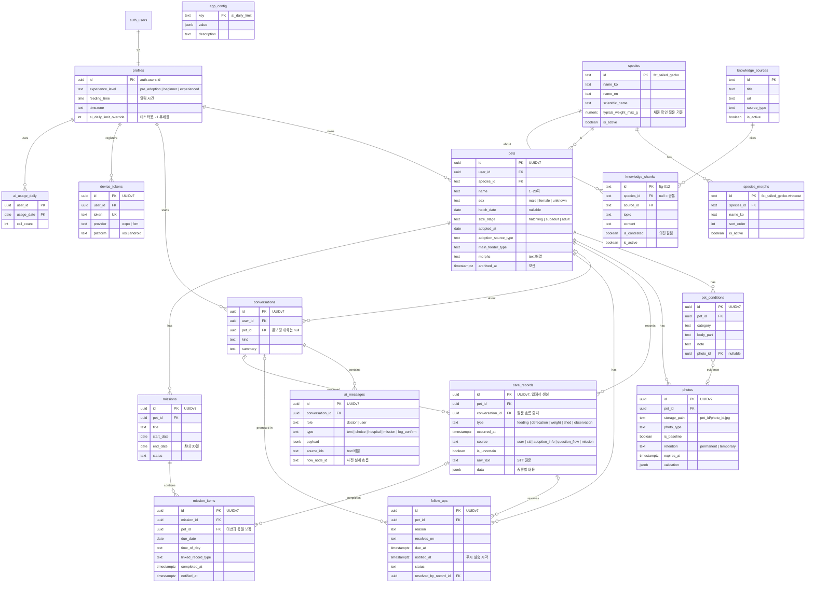

# 10. DB 구조

> 상태: **완성 (2026-10-07)**
> 다음 단계: 와이어프레임

이 문서는 데이터를 **무엇을, 왜** 이렇게 저장하기로 했는지를 다룬다.

---

## 한눈에 보기

**테이블 17개**

| 영역        | 테이블                                    | 역할                                         |
| ----------- | ----------------------------------------- | -------------------------------------------- |
| 사용자      | `profiles`                                | 경험 수준, 알림 시간, 시간대                 |
| 기준 데이터 | `species`, `species_morphs`               | 종 정보·체중 기준, 종별 모프 선택지          |
| 앱 설정     | `app_config`                              | 배포 없이 바꾸는 운영 값 (박사 일일 한도 등) |
| 개체        | `pets`, `pet_conditions`, `photos`        | **신분증**: 개체 정보, 특이사항, 사진        |
| 기록        | `care_records`                            | **일기장**: 먹이·배변·체중·탈피·관찰         |
| 박사        | `conversations`, `ai_messages`            | 대화와 메시지                                |
|             | `follow_ups`, `missions`, `mission_items` | 박사의 약속, 적응 미션과 날짜별 항목         |
| 알림        | `device_tokens`                           | 푸시 알림을 받을 기기                        |
| 사용량      | `ai_usage_daily`                          | 사용자별 박사 일일 사용 횟수                 |
| 지식        | `knowledge_sources`, `knowledge_chunks`   | 박사가 참고하는 자료와 출처                  |

---

## ERD

---

## 설계 원칙

| 원칙             | 내용                                                        | 이유                                                           |
| ---------------- | ----------------------------------------------------------- | -------------------------------------------------------------- |
| 확장성           | 총 사용자 100만 규모에서도 구조 변경 없이 확장              | 나중에 바꾸기 어려운 것은 지금, 쉽게 붙는 것은 나중에          |
| 기록 통합        | 먹이·배변·체중·탈피·관찰을 **한 테이블**에 종류로 구분      | 기록 목록, 음성 다중 기록, 이상 감지가 모두 "기록 전체"를 다룸 |
| 권한은 개체 기준 | 데이터의 주인은 **개체를 통해** 확인                        | 나중에 개체 소유권 이전·가족 공유가 생겨도 한 곳만 수정        |
| 기록자 분리      | 각 기록에 "누가 남겼는지" 별도 저장                         | 가족 공유 시 "엄마가 남긴 기록" 구분                           |
| 시간             | 날짜 계산은 **사용자 시간대** 기준                          | 자정 근처 기록, 해외 확장                                      |
| 삭제 대신 보관   | 개체는 보관, 지식 자료는 비활성화                           | 추억 보존, 과거 답변의 참고 자료 유지                          |
| DB가 지킨다      | 잘못된 데이터는 앱이 아니라 **DB가 최종적으로 막음**        | 앱에 버그가 있어도 데이터가 오염되지 않음                      |
| 로딩 없는 앱     | 화면을 먼저 바꾸고 저장은 뒤에서 (기록 ID를 앱이 미리 생성) | 사용자가 기다리는 순간 제거                                    |

---

## 영역별 핵심

### 사용자

- 계정이 생기면(익명 포함) 프로필이 자동으로 만들어짐 → 온보딩 중 익명 상태에서도 경험 수준 저장 가능
- 익명 → 회원가입 전환 시 같은 계정으로 이어짐
- 사용자 닉네임은 받지 않음. 박사는 "**○○ 집사**"로 부름 (개체 이름 활용)

### 개체 — 신분증

- 나이: 생년월일 또는 크기 단계 중 하나는 필수
- **회원가입 후에만 개체 등록 가능** (08 "개체 등록 직전 가입" 흐름을 DB가 보장)
- **보관**: 무지개다리·입양 보냄 시 삭제 대신 보관
  - 기록·사진은 추억으로 남고, 홈·박사 대화에서는 빠짐
  - 진행 중인 박사의 약속·미션은 자동 종료, 새 기록 불가
  - 보관된 개체에 대한 알림은 절대 가지 않음
- 사진 파일은 개체별 폴더에 저장, 개체·계정 삭제 시 함께 정리

### 기록 — 일기장

박사가 개체에 대해 아는 정보는 두 곳에서 온다.

| 테이블         | 정보                                            | 비유                           |
| -------------- | ----------------------------------------------- | ------------------------------ |
| `pets`         | 이름, 종, 나이, 성별, 모프, 분양일, 특이사항    | **신분증**: 누구인지           |
| `care_records` | 먹이, 배변, 체중, 탈피, 관찰 (시간에 따라 쌓임) | **일기장**: 무슨 일이 있었는지 |

| 종류 | 저장 내용                                                                |
| ---- | ------------------------------------------------------------------------ |
| 먹이 | 먹이 종류, 수량(선택), **결과** (먹음 / 안 먹음 / 조금 먹음 / 모름)      |
| 배변 | 상태 (정상 / 묽음 / 물 같음 / 모름), 이상 소견 (피·점액·소화 안 된 먹이) |
| 체중 | 그램                                                                     |
| 탈피 | 상태 (완료 / 진행 중 / 껍질 남음)                                        |
| 관찰 | 박사 질문에 대한 답 (예: 바닥 온도 "따뜻함")                             |

- 모든 기록에 **출처**(직접 입력 / 음성 / 분양 정보 / 박사 질문 / 미션)와 **불확실 여부** 저장
- 분양 시 받은 정보(마지막 급여일 등)와 첫 체중도 입양 전 기록으로 여기에 저장
- **체중 오입력**: DB는 명백한 오류(20kg 초과)만 막고, 흔한 실수(19.2g → 192g)는 박사가 "지난번엔 19.0g이었는데 192g 맞아?"라고 확인
- 분양일 이전 날짜의 일반 기록, 미래 시각 기록은 막음

### 박사

- **개체 없는 대화**: 1B 긴급 점검은 가입·개체 등록 전에 일어남 → 대화는 개체 없이도 존재 가능. 등록 직후 대화를 개체에 연결하고 점검 답변을 관찰 기록으로 옮김
- **메시지는 수정·삭제 불가**. 박사 메시지는 미리 설계한 질문 흐름이거나 서버의 LLM 답변만 가능 → 사용자가 박사의 말을 위조할 수 없음
- 선택지 답변은 "어떤 질문에 어떤 답을 골랐는지"를 사용자 메시지로 남김
- **약속**: 개체당 진행 중인 약속은 하나. 새 약속이 생기면 기존 약속은 자동 대체. 해당 기록이 들어오면 자동 해결 ("먼저 알려줬네!")
- **미션**: 개체당 진행 중인 미션은 하나, 최대 30일. 날짜별 항목으로 저장하고, 미션 체크 대신 일반 기록을 남겨도 자동 체크

### 알림 — 서버 푸시

- 알림은 기기가 아니라 **서버가 보냄** → 사용자의 모든 기기에 도착, 재설치·기기 변경에도 영향 없음
- 보내기 직전에 약속 상태를 확인 → **해결된 약속, 보관된 개체에는 알림이 갈 수 없는 구조**
- 같은 알림이 두 번 가지 않음
- 같은 기기에서 다른 계정으로 로그인하면 알림도 새 계정 기준으로 바뀜

### 박사 사용량 제한

LLM 호출 비용이 운영비의 대부분이라 사용자별 일일 한도를 둔다.

| 시기           | 운영                                                       |
| -------------- | ---------------------------------------------------------- |
| 개발·테스트    | 한도 없음 (현재 기본값)                                    |
| 서비스 시작    | 서버 설정에서 한도를 숫자로 변경 (앱 업데이트·배포 불필요) |
| 출시 후 테스트 | 테스터 계정만 한도 해제, 일반 사용자 한도는 유지           |

- 미리 설계한 질문 흐름(긴급 점검 등)은 LLM을 쓰지 않으므로 차감 없음
- 하루 기준은 사용자 시간대의 날짜
- 이후 무료/유료 한도 구분에도 같은 구조 사용

### 지식

박사가 커지는 지식을 감당하는 3단계.

| 단계   | 방식                                | 언제                 |
| ------ | ----------------------------------- | -------------------- |
| 1 (V0) | 해당 종의 자료 전부를 박사에게 전달 | 자료가 적을 때       |
| 2      | 주제로 먼저 거르고 관련 자료만      | 자료가 많아질 때     |
| 3      | 의미 검색 (RAG)                     | 종·자료가 크게 늘 때 |

- 출처와 자료 조각을 분리 → 링크가 바뀌어도 한 곳만 수정, "참고 자료 보기"에서 출처별로 묶어 표시
- **의견이 갈리는 주제** 표시 → 박사가 "이건 의견이 갈리는 부분이야"라고 균형 있게 답변 (05 품질 기준)
- LLM이 존재하지 않는 참고 자료를 지어내면 저장 시 자동으로 걸러짐

---

## 서버가 하는 일

| 작업           | 언제                 | 내용                                                         |
| -------------- | -------------------- | ------------------------------------------------------------ |
| 박사 대화      | 사용자가 질문할 때   | 사용량 확인 → 답변 생성 → 저장                               |
| 기록 시점 검사 | 기록 저장 후         | 최근 기록으로 이상 여부 판단 → 박사 반응 (04)                |
| 알림 발송      | 1분마다              | 시간이 된 약속·미션 알림 발송                                |
| 일일 정리      | 하루 1회             | 만료된 임시 사진, 버려진 사진 파일, 30일 지난 익명 계정 정리 |
| 계정 삭제      | 사용자 요청 시 (S13) | 사진 파일과 모든 데이터 즉시 삭제 (**Apple 심사 요건**)      |

---

## 테이블로 만들지 않은 것

| 항목                                | 어디에                       | 이유                         |
| ----------------------------------- | ---------------------------- | ---------------------------- |
| 질문 흐름, 입양 전 가이드, 읽을거리 | 앱 안에 내장                 | 서버를 거치지 않아 즉시 표시 |
| 진료용 기록 요약                    | 병원 권고 메시지에 함께 저장 | 권고 시점의 기록 상태 보존   |
| 사진 파일                           | 파일 저장소                  | 테이블엔 사진 정보만         |

**나중에 추가될 것**: 가족 공유, 사육장 정보, 지식 의미 검색(RAG)

---

## 예외 상황 처리

DB가 막아주는 주요 상황들.

| 영역   | 상황                                                | 처리                                      |
| ------ | --------------------------------------------------- | ----------------------------------------- |
| 사용자 | 다른 사람의 데이터 조회·수정                        | 차단 (보이지 않음)                        |
|        | 사용자가 자기 박사 한도를 변경                      | 차단                                      |
| 개체   | 나이 정보 없음, 출생일 > 분양일, 미래 날짜, 빈 이름 | 저장 거부                                 |
|        | 익명 계정이 개체 등록                               | 차단                                      |
|        | 개체를 다른 사람에게 넘기기                         | 차단                                      |
|        | 남의 개체 폴더에 사진 업로드                        | 차단                                      |
| 기록   | 같은 기록이 재시도로 두 번 전송                     | 한 번만 저장                              |
|        | 음성으로 여러 기록 저장 중 하나가 잘못됨            | 전부 저장 안 됨 (일부만 저장되는 일 없음) |
|        | 필수값 누락, 숫자 자리에 글자                       | 저장 거부                                 |
|        | 보관된 개체에 기록, 기록을 다른 개체로 이동         | 차단                                      |
|        | 분양일 이전 일반 기록                               | 거부 → 분양일 수정 안내                   |
| 박사   | 박사 메시지 위조                                    | 차단                                      |
|        | 약속·미션이 동시에 두 개                            | 자동 대체 / 차단                          |
|        | 알림 전에 먼저 기록                                 | 약속 자동 해결, 알림 안 감                |
| 알림   | 보관된 개체·해결된 약속 알림                        | 발송 안 됨                                |
|        | 같은 알림 중복 발송                                 | 발생 안 함                                |
| 사용량 | 한도 초과                                           | "오늘은 여기까지" 안내                    |
| 지식   | 존재하지 않는 참고 자료                             | 자동 제거                                 |

> 실제 PostgreSQL 환경에서 위 상황들을 시나리오 75개로 검증 완료.

---

## 결정 로그

| 날짜       | 결정                                      | 이유                                           |
| ---------- | ----------------------------------------- | ---------------------------------------------- |
| 2026-10-07 | DB 구조를 와이어프레임보다 먼저           | 화면에 보여줄 데이터를 먼저 확정               |
| 2026-10-07 | 기록 테이블 통합, 이름 `care_records`     | 1인 개발 부담 감소, "사육 기록"이 바로 드러남  |
| 2026-10-07 | 권한은 개체 기준                          | 소유권 이전·가족 공유 확장성                   |
| 2026-10-07 | 기록자 별도 저장                          | 가족 공유 대비                                 |
| 2026-10-07 | 사용자 닉네임 받지 않음                   | 입력 부담·어색함, "○○ 집사" 호칭               |
| 2026-10-07 | 개체 보관 기능                            | 추억 보존, 알림·기록 차단                      |
| 2026-10-07 | 체중: DB는 명백한 오류만, 앱이 확인 질문  | 고정 상한은 종 확장을 막고 흔한 실수는 못 잡음 |
| 2026-10-07 | 분양일 이전 기록 차단                     | 박사 판단 보호                                 |
| 2026-10-07 | 대화는 개체 없이도 존재 가능              | 긴급 점검은 개체 등록 전                       |
| 2026-10-07 | 미션 항목은 날짜별 저장                   | 날짜별 체크를 단순하게                         |
| 2026-10-07 | 알림: 로컬 → **서버 푸시 (V0)**           | 여러 기기·재설치 대응, 잘못된 알림 구조적 차단 |
| 2026-10-07 | 지식: 출처 분리, 의견 갈림 표시, 비활성화 | 출처 관리, 균형 있는 답변, 과거 답변 유지      |
| 2026-10-07 | 박사 메시지 수정·삭제 불가                | 위조 방지                                      |
| 2026-10-07 | 박사 일일 한도 (서버 설정 + 테스터 예외)  | 비용 통제, 배포 없이 조정                      |
| 2026-10-07 | 앱 내 계정 삭제                           | Apple 심사 요건                                |
| 2026-10-07 | 버려진 익명 계정 정리                     | 누적·남용 방지                                 |
| 2026-10-07 | 테이블 17개 확정                          |                                                |
